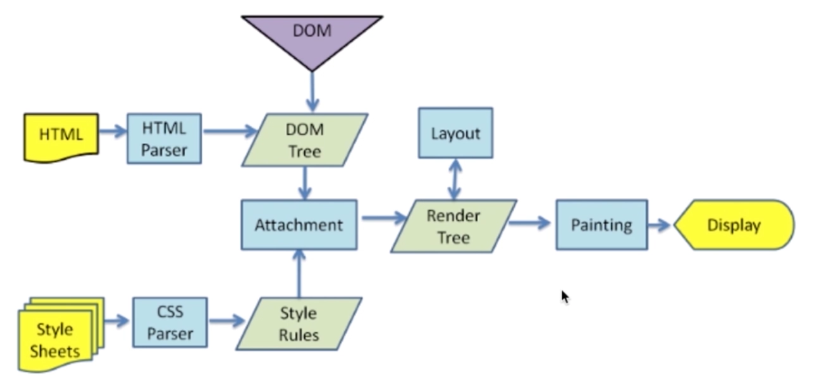

## 面试技巧
- 知识面要广
- 理解要深刻（比如了解浏览器的特性，了解js引擎）
- 内心要诚实
- 态度要谦虚
- 回答要灵活
- 要学会赞美

#### 面试模拟
- 渲染机制
- js运行机制
- 页面性能
- 错误监控

## 渲染机制

- 什么是DOCTYPE及作用
- 浏览器渲染过程？输入url后的流程？
- 什么叫浏览器的Reflow?
- 设么叫Repaint?
- 布局Layout?
    
##### 什么是DOCTYPE及作用？DTD是一系列的语法规则，用来定义xml或html的文件类型。浏览器会使用它来判断文档类型，决定使用何种协议来解析，以及切换浏览器模式。DOCTYPE是用来声明文档类型和DTD规范的，一个主要的用途便是文件的合法性验证。如果文件代码不合法，那么浏览器解析时便会出一些差错。

- HTML5-----<!DOCTYPE html>
- HTML 4.01 Strict该DTD包含所有HTML元素和属性，但不包括展示型的和弃用的元素<!DOCTYPE HTML PUBLIC "-//W3C//DTD HTML 4.01//EN" "http://www.w3.org/TR/html4/strict.dtd">(这个不用记)
- HTML 4.01 Transitional 该DTD包含所有HTML元素和属性，包括展示性的和弃用的元素<!DOCTYPE HTML PUBLIC "-//W3C//DTD HTML 4.01 Transitional//EN" "http://www.w3.org/TR/html4/loose.dtd">（这个不用记）

##### 浏览器渲染过程
 

##### 重排Reflow
> 定义:DOM结构中的各个元素都有自己的盒子（模型），这些都需要浏览器根据各种样式来计算并根据计算结果将元素放到它该出现的位置，这个过程称为reflow

> 触发Reflow
- 当你增加，删除，修改DOM节点时，会导致Reflow或Repaint
- 当你移动DOM的位置，或是搞个动画的时候
- 当你修改css样式的时候
- 当你Resize窗口的时候（移动端没有这个问题）或是滚动的时候（有可能触发）
- 当你修改网页的默认字体时

##### 重绘Repaint

> 定义：当各种盒子的位置，大小以及其他属性，例如颜色、字体大小等都确定下来后，浏览器于是便把这些元素都按照各自的特性绘制了一遍，于是页面的内容出现了，这个过程称为repaint

> 触发Repaint
- DOM改动
- css改动

> 怎样尽量减少repaint？
- 使用documentFragment，一次性加入节点

## js运行机制
- 如何理解JS的单线程
- 什么是任务队列
- 什么是Event Loop:  执行栈执行的是同步任务，什么时候去异步队列取这个任务？什么时候往这个异步队列中放这个异步任务。

##### 什么时候会开启异步任务？
- setTimeout和setInterval
- DOM事件
- ES6中的Promise

#### 运行机制总结
- 理解JS的单线程的概念：一个时间内只能干一件事
- 理解任务队列：包括同步任务和异步任务
- 理解Event Loop
- 理解哪些语句会放入异步任务队列（重要）
- 理解语句放入异步任务队列的时机（重要）

## 页面性能

> 题目：提升页面性能的方法有哪些？
1. 资源压缩合并，减少HTTP请求
2. 非核心代码异步加载?->异步加载的方式?->异步加载方式的区别?
3. 利用浏览器缓存？->缓存的分类？->缓存的原理？
4. 使用CDN
5. 预解析DNS

    <meta http-equiv="x-dns-prefetch-control" content="on">  // 浏览器默认打开，但是在https的网站中不会默认打开，加这一句强制默认打开dns预解析
    <link rel="dns-prefetch" href="//host_name_to_prefetch.com">
    
##### 异步加载
1. 异步加载的方式：
    
    - 动态脚本加载，js动态创建脚本
    - defer，
    - async
    
2. 异步加载的区别
    
    - defer是在HTML解析完成之后才会执行，如果是多个，按照加载的顺序依次执行
    - async是在加载完成后立即执行，如果是多个，执行顺序和加载顺序无关
    
##### 浏览器缓存
1. 缓存的分类
    
    1). 强缓存：在有效时间内不从服务器请求，若下面两者都从服务器下发了，应该以cache-control为准
            
       Expires Expires:thu,21 Jan 2017 23:39:02 GMT  //这里的时间表示服务器的绝对时间，但是是与浏览器的时间比较，下发时间的是服务器，服务器时间可能和浏览器时间不一致
       Cache-Control Cache-Control:max-age=3600 // 这里表示客户端相对时间，单位为秒
    2). 协商缓存   
        
        Last-Modified(服务器下发的),If-Modified-Since（从服务器请求的时候加上） Last-Modified:wed,26 Jan 2017 00:35:11 GMT，Etag,If-None-match
        
## 错误监控类
- 前端错误的分类
- 错误的捕获方式
- 上报错误的基本原理

##### 前端错误的分类
- 即时运行错误：代码错误
- 资源加载错误
 
##### 错误的捕获方式
1. 即时运行错误的捕获方式

- try...catch
- window.onerror（这个无法捕获资源加载错误）

2. 资源加载错误

- object.onerror（节点上绑error事件）
- performance.getEntries()（可以间接知道资源是否加载，重要）
- Error事件捕获（重要）

> 延伸：跨域的js运行错误可以捕获吗？错误提示什么，应该怎么处理？

>> 可以捕获到，如上图，但是只是提示Script error,不能提供其他具体的信息。

>> 解决方法：
    1. 在客户端script标签增加crossorigin属性
    2. 设置服务器js资源响应头Access-Control-Allow-Origin:*
    
##### 上报错误的基本方式
1. 采用Ajax通信的方式上报
2. 利用Image对象上报（用的更多）

