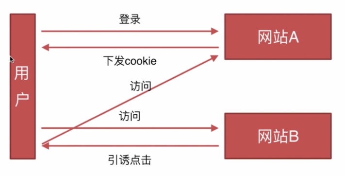

# CSRF

- 基本概念和缩写？
    
    CSRF,通常称为跨站请求伪造，英文名Cross-site request forgery缩写CSRF

- 攻击原理
    
    攻击者盗用了你的身份，以你的名义发送恶意请求。

- 要完成一次CSRF攻击，受害者必须依次完成两个步骤：
    + 登录受信任网站A，并在本地生成Cookie
    + 在不登出A的情况下，访问危险网站B

- csrf攻击的具体流程是什么样的，为什么B网站的请求会带上A网站的cookies?

    因为B网站发出的是A网站的请求

- 防御措施？
    + Token验证，因为攻击携带的是原来网站的cookie，并没有带token，cookie是自动发送，token需要手动通过参数的形式发送
    + 验证码，每次的用户提交都需要用户在表单中填写一个图片上的随机字符串
    + 判断 referer 头（请求网站来源域名信息），如果不是来自本网站的请求，就判定为CSRF攻击。但是该方法只能防御跨站的csrf攻击，不能防御同站的csrf攻击