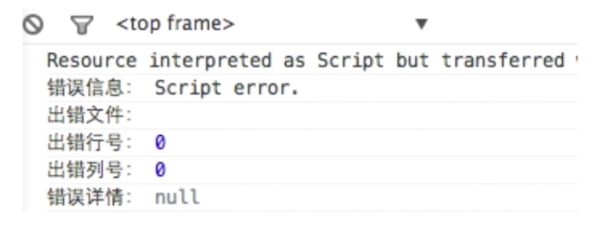

# 面试题
[连接](https://segmentfault.com/a/1190000011635556)

#### 面试模拟
- 渲染机制
- js运行机制
- 页面性能
- 错误监控

## 渲染机制

- 什么是DOCTYPE及作用
- 浏览器渲染过程？输入url后的流程？
- 什么叫浏览器的Reflow?
- 设么叫Repaint?
- 布局Layout?

##### 重排Reflow
> 定义:DOM结构中的各个元素都有自己的盒子（模型），这些都需要浏览器根据各种样式来计算并根据计算结果将元素放到它该出现的位置，这个过程称为reflow

<b>触发Reflow</b>
- 当你增加，删除，修改DOM节点时，会导致Reflow或Repaint
- 当你移动DOM的位置，或是搞个动画的时候
- 当你修改css样式的时候
- 当你Resize窗口的时候（移动端没有这个问题）或是滚动的时候（有可能触发）
- 当你修改网页的默认字体时

##### 重绘Repaint

> 定义：当各种盒子的位置，大小以及其他属性，例如颜色、字体大小等都确定下来后，浏览器于是便把这些元素都按照各自的特性绘制了一遍，于是页面的内容出现了，这个过程称为repaint

**触发Repaint**
- DOM改动
- css改动

**怎样尽量减少Reflow**
- 使用documentFragment，一次性加入节点。或者用display:none对元素隐藏，在元素消失后进行相关的操作。
- 在使用js对元素样式进行读写操作时最好将两者分开，先读后写，最好不要用js去操作样式。
- 图片在渲染前指定大小，因为在图片加载完成后会改变宽高，严重情况会导致整个页面发生重排。
- 页面中需要大量重排的元素单独触发渲染层，使用gpu分担cpu压力。

**减少重绘**：
- 不要每次用js获取css样式或改变样式，应该用class或者元素的style.csstest一次切换。减少重绘次数。

## js运行机制
[参考](https://www.cnblogs.com/MasterYao/p/5563725.html)

- 如何理解JS的单线程
- 什么是任务队列
- 什么是Event Loop:  执行栈执行的是同步任务，什么时候去异步队列取这个任务？什么时候往这个异步队列中放这个异步任务。

##### 什么时候会开启异步任务？
- setTimeout和setInterval
- DOM事件
- ES6中的Promise
- 文件读取
- 网络请求

#### 运行机制总结
- 理解JS的单线程的概念：一个时间内只能干一件事
- 理解任务队列：包括同步任务和异步任务
- 理解Event Loop
- 理解哪些语句会放入异步任务队列（重要）
- 理解语句放入异步任务队列的时机（重要）

## 页面性能

> 题目：提升页面性能的方法有哪些？
1. 资源压缩合并，减少HTTP请求
2. 非核心代码异步加载?->异步加载的方式?->异步加载方式的区别?
3. 利用浏览器缓存？->缓存的分类？->缓存的原理？
4. 使用CDN
5. 预解析DNS

    <meta http-equiv="x-dns-prefetch-control" content="on">  // 浏览器默认打开，但是在https的网站中不会默认打开，加这一句强制默认打开dns预解析
    <link rel="dns-prefetch" href="//host_name_to_prefetch.com">
    
##### 异步加载
1. 异步加载的方式：
    
    - 动态脚本加载，js动态创建脚本
    - defer，
    - async
    
2. 异步加载的区别
    
    - defer是在HTML解析完成之后才会执行，DOMContentLoaded事件触发执行之前。如果是多个，按照加载的顺序依次执行
    - async是在加载完成后立即执行，如果是多个，执行顺序和加载顺序无关（IE不支持async，只支持defer）
    
##### 浏览器缓存
1. 缓存的分类
    
    1). 强缓存：在有效时间内不从服务器请求，若下面两者都从服务器下发了，应该以cache-control为准
            
       Expires Expires:thu,21 Jan 2017 23:39:02 GMT  //这里的时间表示服务器的绝对时间，但是是与浏览器的时间比较，下发时间的是服务器，服务器时间可能和浏览器时间不一致
       Cache-Control Cache-Control:max-age=3600 // 这里表示客户端相对时间，单位为秒
       强缓存，在未过期时，必须更新资源路径才能发起新的请求。
    2). 协商缓存   
        
        Last-Modified(服务器下发的),If-Modified-Since（从服务器请求的时候加上） Last-Modified:wed,26 Jan 2017 00:35:11 GMT，Etag,If-None-match
        
## 错误监控类
- 前端错误的分类
- 错误的捕获方式
- 上报错误的基本原理

##### 前端错误的分类
- 即时运行错误：代码错误
- 资源加载错误
 
##### 错误的捕获方式
1. 即时运行错误的捕获方式

- try...catch
- window.onerror（这个无法捕获资源加载错误）

2. 资源加载错误

- object.onerror（节点上绑error事件）
- performance.getEntries()（可以间接知道资源是否加载，重要）
- Error事件捕获（重要）

> 延伸：跨域的js运行错误可以捕获吗？错误提示什么，应该怎么处理？

>> 可以捕获到，如上图，但是只是提示Script error,不能提供其他具体的信息。

>> 解决方法：
    1. 在客户端script标签增加cross-origin属性
    2. 设置服务器js资源响应头Access-Control-Allow-Origin:*
    
##### 上报错误的基本方式
1. 采用Ajax通信的方式上报
2. 利用Image对象上报（用的更多）

##### 浏览器缓存机制？
现代前端技术解析P48

##### 移动端300ms点击延迟解决方案？
1. 禁用缩放
    `<meta name="viewport" content="user-scalable=no">
     <meta name="viewport" content="initial-scale=1,maximum-scale=1">`
     
2. 更改默认的视口宽度，浏览器就可以认为该网站已经对移动端做过了适配和优化，就无需双击缩放操作了。
    <meta name="viewport" content="width=device-width">
    
它没有完全禁用缩放，而只是禁用了浏览器默认的双击缩放行为，但用户仍然可以通过双指缩放操作来缩放页面。

3. 方案三：CSS touch-action

**当前如何避免延迟**
1. 指针事件的 polyfill
2. FastClick 是 FT Labs 专门为解决移动端浏览器 300 毫秒点击延迟问题所开发的一个轻量级的库，原理是：检测到touchend事件后，立刻出发模拟click事件，并且把浏览器300毫秒之后真正出发的事件给阻断掉

**点击穿透的问题**：
使用touchstart去代替click事件有两个不好的地方。
1. touchstart是手指触摸屏幕就触发，有时候用户只是想滑动屏幕，却触发了touchstart事件，这不是我们想要的结果；
2. 使用touchstart事件在某些场景下可能会出现点击穿透的现象。

点击穿透：假如页面上有两个元素A和B。B元素在A元素之上。我们在B元素的touchstart事件上注册了一个回调函数，该回调函数的作用是隐藏B元素。我们发现，当我们点击B元素，B元素被隐藏了，随后，A元素触发了click事件。
这是因为在移动端浏览器，事件执行的顺序是touchstart > touchend > click。而click事件有300ms的延迟，当touchstart事件把B元素隐藏之后，隔了300ms，浏览器触发了click事件，但是此时B元素不见了，所以该事件被派发到了A元素身上。如果A元素是一个链接，那此时页面就会意外地跳转。

##### 如果要你去实现一个前端模板引擎，你会怎么做

##### 一个静态资源要上线，里面有各种资源依赖，你如何平稳上线

##### 去除代码里面所有的空格和换行，你怎么做？

##### let暂时性死区
[参考阮一峰es6指南](http://es6.ruanyifeng.com/#docs/let#%E6%9A%82%E6%97%B6%E6%80%A7%E6%AD%BB%E5%8C%BA)

暂时性死区的本质就是，只要一进入当前作用域，所要使用的变量就已经存在了，但是不可获取，只有等到声明变量的那一行代码出现，才可以获取和使用该变量。

##### 如何实现图片滚动懒加载？
这里看懂可以说是自己的实现
[参考1](http://www.zyy1217.com/2017/03/16/%E9%AB%98%E6%80%A7%E8%83%BD%E6%BB%9A%E5%8A%A8%20scroll%20%E5%8F%8A%E9%A1%B5%E9%9D%A2%E6%B8%B2%E6%9F%93%E4%BC%98%E5%8C%96/)

[参考2](http://www.zyy1217.com/2017/03/20/js%E5%AE%9E%E7%8E%B0%E4%B8%80%E4%B8%AA%E5%9B%BE%E7%89%87%E6%87%92%E5%8A%A0%E8%BD%BD%E6%8F%92%E4%BB%B6/)

##### 深度遍历dom树的代码？

##### 原生JS实现一个类型百度搜索的自动完成控件。
[参考链接](https://github.com/fyuanfen/fyuanfen.github.io/tree/master/searchlist)

##### web Quality(无障碍)
能够被残障人士使用的网站才能称得上一个易用的（易访问的）网站。
残障人士指的是那些带有残疾或者身体不健康的用户。
使用alt属性：

    

有时候浏览器会无法显示图像。具体的原因有：

- 用户关闭了图像显示
- 浏览器是不支持图形显示的迷你浏览器
- 浏览器是语音浏览器（供盲人和弱视人群使用）
- 如果您使用了 alt 属性，那么浏览器至少可以显示或读出有关图像的描述。

