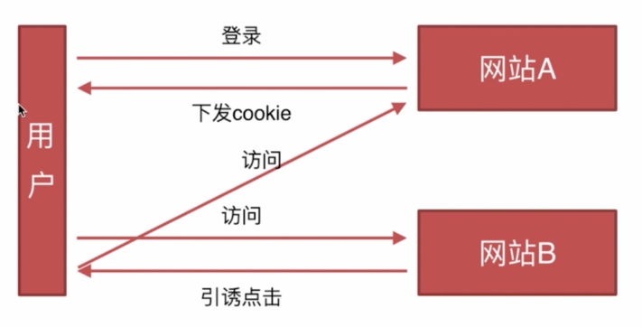

### 算法类（阿里很重视）
- 排序
- 堆栈，队列，链表。js的数组就具有堆栈和队列的特性
- 递归
- 波兰式和逆波兰式

> 阿里云，金融对算法要求比较高

##### 排序

 
- 快速排序：https://segmentfault.com/a/1190000009426421
- 选择排序：https://segmentfault.com/a/1190000009366805
- 希尔排序：https://segmentfault.com/a/1190000009461832

##### 堆栈，队列，链表
- https://juejin.im/entry/58759e79128fe1006b48cdfd

##### 递归
- https://segmentfault.com/a/1190000009857470

##### 波兰式和逆波兰式
- 理论：http://www.cnblogs.com/chenying99/p/3675876.html
- 源码：https://github.com/Tairraos/rpn.js/blob/master/rpn.js

##### 面试技巧
- 若问题没懂可以问问面试官，可以请求提示
- 面试中能写多少是多少，尽量写，不懂可以再次请求面试官帮助。若确实不知道怎么写，要说出这个题目的原理和思路。
